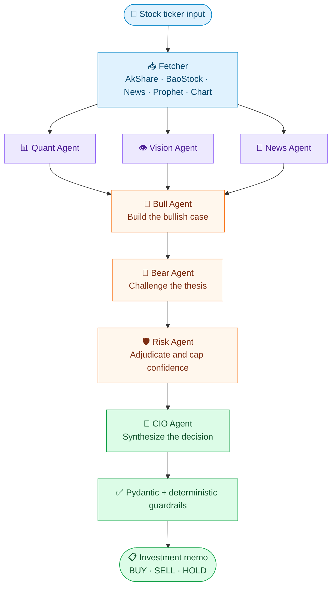

# Multi-Agent Stock Research System

### An AI-powered financial research pipeline with seven specialized agents

**Multimodal Analysis · Agentic Debate · Structured Decisions · Risk Guardrails**

<p>
  
  
  
  
</p>

<p>
  <a href="#-overview">Overview</a> •
  <a href="#-architecture">Architecture</a> •
  <a href="#-meet-the-seven-agents">Agents</a> •
  <a href="#-quick-start">Quick Start</a> •
  <a href="#-sample-run">Demo</a> •
  <a href="#-roadmap">Roadmap</a>
</p>

</div>

---

## Overview

**Multi-Agent Stock Research System** is a Python-based, research-oriented AI application that coordinates **seven specialized LLM agents** to analyze Chinese A-share stocks. Rather than relying on a single prompt, the system combines quantitative market signals, candlestick-chart interpretation, and news analysis with an evidence-based **bull-versus-bear debate** and a final **risk-aware investment memo**.

> [!IMPORTANT]
> **Research and education only.** This project is **not** an automated trading platform or a source of financial advice. Its model-generated recommendations have not been validated as profitable trading signals.

### At a glance

| | Capability | Implementation |
|:--:|---|---|
| 🧩 | **Agent orchestration** | LangGraph shared state, parallel branches, sequential dependencies |
| 👁️ | **Multimodal reasoning** | Vision-language model analyzes generated K-line charts |
| 📈 | **Quantitative research** | OHLC, volume, technical indicators, Prophet forecasting |
| 🗞️ | **Unstructured data** | Company/industry news analysis and sentiment assessment |
| 🔁 | **Resilience** | Market-data fallback, LLM model pools, rate-limit handling |
| 🛡️ | **Validated decisions** | Pydantic schemas, confidence constraints, OHLC-based guardrails |

---

## Architecture



**Execution model:** Quant, Vision, and News run as independent research branches. LangGraph waits for **all three** before starting Bull → Bear → Risk → CIO. A deterministic Fetcher prepares the inputs; it is **not** an eighth AI agent.

---

## Meet the Seven Agents

| # | Agent | Role | Main deliverable |
|:--:|---|---|---|
| **01** | 📊 **Quant Analyst** | Analyzes price, volume, RSI/MACD, Prophet forecasts, and available capital-flow signals | Quantitative outlook and risk assessment |
| **02** | 👁️ **Vision Analyst** | Inspects generated candlestick charts using a multimodal LLM | Visual trend and chart-pattern interpretation |
| **03** | 📰 **News Analyst** | Assesses news relevance, recency, sentiment, and possible catalysts | News summary and sentiment assessment |
| **04** | 🐂 **Bull Researcher** | Builds the strongest evidence-backed buy/hold argument | Bullish investment thesis |
| **05** | 🐻 **Bear Researcher** | Critiques the bullish thesis and identifies downside scenarios | Bearish counterarguments |
| **06** | 🛡️ **Risk Manager** | Weighs competing evidence and limits unsupported confidence | Risk verdict and confidence cap |
| **07** | 🎯 **CIO** | Synthesizes upstream reports into one structured decision | Final investment memo |

### Why multiple agents?

A single LLM can mix evidence gathering, interpretation, and decision-making in one opaque response. This architecture **separates those responsibilities**, introduces an explicit challenge-and-review stage, and makes intermediate reports inspectable. It does **not** guarantee better predictions; that requires evaluation and backtesting.

---

## Technology Stack

| Layer | Tools |
|---|---|
| **Language** | Python |
| **Agent framework** | LangGraph, LangChain |
| **LLM provider** | OpenRouter via OpenAI-compatible API |
| **Multimodal inference** | Vision-language models with chart-image input |
| **Market data** | AkShare, BaoStock |
| **Forecasting & analysis** | Prophet, pandas, technical indicators |
| **Output validation** | Pydantic, JSON Schema, deterministic Python checks |
| **Configuration** | `python-dotenv` |
| **User interface** | Rich-formatted command-line interface |

---

## Quick Start

### Prerequisites

- Python 3 and `pip`
- An [OpenRouter API key](https://openrouter.ai/keys)
- Network access for market data and LLM requests
- Optional news-search credentials, depending on your `src/tools.py` configuration

### 1 · Clone and enter the project

```bash
git clone <YOUR_REPOSITORY_URL>
cd <YOUR_REPOSITORY_DIRECTORY>
```

Replace the placeholders with your published repository URL and folder name.

### 2 · Create a virtual environment

**Windows PowerShell**

```powershell
python -m venv .venv
.\.venv\Scripts\Activate.ps1
```

**macOS / Linux**

```bash
python3 -m venv .venv
source .venv/bin/activate
```

### 3 · Install dependencies

```bash
pip install -r requirements.txt
```

> [!NOTE]
> This command assumes your repository includes a tested `requirements.txt`. Generate and commit one before publishing if it does not already exist.

### 4 · Configure OpenRouter

Create a `.env` file in the project root:

```dotenv
OPENAI_API_KEY=your_openrouter_api_key
OPENAI_BASE_URL=https://openrouter.ai/api/v1
APP_LANGUAGE=cn

# Optional: configure model pools per agent category
QUANT_MODELS=openrouter/free
NEWS_MODELS=openrouter/free
DEBATE_MODELS=openrouter/free
CIO_MODELS=openrouter/free
VISION_MODELS=openrouter/free

LLM_MAX_CONCURRENCY=1
LLM_TIMEOUT_SECONDS=90
```

> [!CAUTION]
> **Never commit `.env` or real API keys.** Free models may change, enforce quotas, or lack required structured-output or vision capabilities.

### 5 · Run the research workflow

```bash
python main.py
```

```text
Enter Stock Code (e.g., 600519 or q to quit): 600519
```

The CLI prints agent progress and the final investment memo.

---

## 🖥️ Sample Run

A local test using **600519 (Kweichow Moutai)** completed all seven remote LLM calls through OpenRouter.

<details>
<summary><b>▶ Expand: successful agent execution log</b></summary>

```text
[StructuredLLM] News: success via nvidia/nemotron-3-super-120b-a12b:free
[StructuredLLM] Quant: success via liquid/lfm-2.5-2.6b:free
[VisionLLM] Vision: success via nvidia/nemotron-3-nano-omni-30b-a3b-reasoning:free
[StructuredLLM] Bull: success via dots-studio/dots-3-note-preview:free
[StructuredLLM] Bear: success via nvidia/nemotron-3-super-120b-a12b:free
[StructuredLLM] Risk: success via nvidia/nemotron-3-super-120b-a12b:free
[StructuredLLM] CIO: success via dots-studio/dots-3-note-preview:free
[Guardrail] CIO prices grounded to real 20-day OHLC
```

</details>

**Investment memo fields**

| Decision | Evidence | Risk management |
|---|---|---|
| BUY / SELL / HOLD | Quantitative, visual, and news reasoning | Confidence and position sizing |
| Suggested price ranges | Company profile and market context | Risk warnings and holding horizon |

> [!NOTE]
> This is evidence of **one successful local execution**, not a measured production uptime, forecasting accuracy, or historical return.

---

## Reliability & Guardrails

<details open>
<summary><b>Data ingestion and fault tolerance</b></summary>

- Attempts historical market-data retrieval with **AkShare**.
- Falls back to **BaoStock** when the primary history source fails.
- Stops the workflow when required market data is unavailable instead of inventing a zero-price report.

</details>

<details open>
<summary><b>LLM routing and structured output</b></summary>

- Uses configurable OpenRouter model pools for text agents and a separate multimodal path for Vision.
- Requests structured JSON Schema responses and validates them locally with **Pydantic**.
- Handles rate limits, incompatible responses, and agent-level deterministic fallbacks.

</details>

<details open>
<summary><b>Risk-aware decision checks</b></summary>

- The Risk Agent provides a **confidence cap** for the final decision.
- The CIO result passes through **OHLC-grounded numerical guardrails**.
- These checks constrain selected outputs; they **do not** independently prove every narrative statement or chart pattern.

</details>

---

## Project Structure

```text
multi-agent-stock-research/
├── main.py                # CLI entry point
├── src/
│   ├── agents.py          # Agent logic and vision integration
│   ├── graph.py           # LangGraph workflow and guardrails
│   ├── models.py          # Pydantic report schemas
│   ├── tools.py           # Data retrieval, charts, forecasting
│   └── settings.py        # Application settings
├── temp_charts/           # Generated runtime charts
├── .env                   # Local secrets (never commit)
└── README.md
```

*Illustrative layout based on the current project; confirm filenames before publishing.*

---

## 🧪 Engineering Challenges

1. **Parallel + sequential orchestration** — synchronize three research branches before the debate begins.
2. **Multimodal data fusion** — combine numerical time series, chart images, and unstructured news.
3. **Unreliable external services** — recover from API disconnections, rate limits, and malformed LLM output.
4. **LLM reliability** — validate schemas, represent missing evidence, and constrain generated prices with deterministic logic.

## 🗺️ Roadmap

Planned improvements (not yet implemented):

- [ ] Historical backtesting and agent-level evaluation datasets
- [ ] Token usage, latency, error-rate, and fallback observability
- [ ] Automated verification of technical-pattern and news claims
- [ ] FastAPI backend and React dashboard
- [ ] Unit/integration tests, Docker, and GitHub Actions CI/CD
- [ ] Confidence calibration and missing-data sensitivity tests

---

## 💼 Project Summary for Recruiters

> **Built a seven-agent multimodal AI research system** with Python, LangGraph, and OpenRouter. Designed parallel market, chart, and news analysis followed by sequential bull/bear debate, risk adjudication, and final decision synthesis. Integrated financial-data APIs, Prophet forecasting, Pydantic schema validation, configurable model routing, provider fallbacks, and deterministic price guardrails.

---

<div align="center">

**Built to explore reliable agentic AI workflows — from data ingestion to validated decisions.**

<sub>Educational research project · Not investment advice</sub>

</div>
